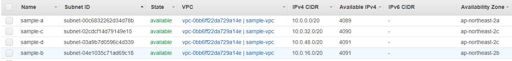

<p align="center">
  <a href="" rel="noopener">
 </a>
 <br>

 
</p>

<h3 align="center">AWS NAT Tutorial</h3>

<div align="center">

[]()
[](https://github.com/da-huin/aws-nat-tutorial/issues)
[](https://github.com/da-huin/aws-nat-tutorial/pulls)
[](/LICENSE)

</div>

---

<p align="center"> 
    <br> In this article, we will learn how to set up NAT.

</p>


## Tutorial

1. **Create VPC**
    1. Create VPC called `sample-vpc`
2. **Create Internet Gateway**
    1. Create Internet Gateway called `sample-gateway`
    2. Connect to `sample-vpc`.
3. **Create Subnets**
    1. Create Subnet like this.

        

4. **Create and Edit Route Table**
    1. Edit subnet associations like this (also make `c-d` the same.)

        

    2. Connect Routes to `sample-gateway (0.0.0.0/0)` 

5. **Create NAT**
    1. Create NAT

        

    2. Fill the forms

        

6. **Create 2 Instance like this.**
    - Open 80(web) and 22(SSH) Port

    

7. **Connect A instance with SSH and run 80 server.**
    1. Use the command below for open 80 port server.

    ```bash
    >>> python3 -m http.server 80
    Serving HTTP on 0.0.0.0 port 80 (http://0.0.0.0:80/) ...
    ```

8. **Connect C instance.**
    1. Use the command below for request to A's Private IP
        1. curl `http://YOUR_A_PRIVATE_IP`
            - result:

                ```bash
                <!DOCTYPE HTML PUBLIC "-//W3C//DTD HTML 4.01//EN" "http://www.w3.org/TR/html4/strict.dtd">
                <html>
                <head>

                ...
                ```

    2. Use the command below for request to A's Public IP.
        1. curl `http://YOUR_A_PUBLIC_IP`
            - result:

                ```bash
                <!DOCTYPE HTML PUBLIC "-//W3C//DTD HTML 4.01//EN" "http://www.w3.org/TR/html4/strict.dtd">
                <html>
                <head>

                ...
                ```

9. **Change the route in A Route table to NAT.**

    

10. **request to A's Public IP and A's Private IP.**
    1. Use the command below for request to A's Private IP
        1. curl `http://YOUR_A_PRIVATE_IP`
            - result:

                ```bash
                <!DOCTYPE HTML PUBLIC "-//W3C//DTD HTML 4.01//EN" "http://www.w3.org/TR/html4/strict.dtd">
                <html>
                <head>

                ...
                ```

    2. Use the command below for request to A's Public IP.
        1. curl `http://YOUR_A_PUBLIC_IP`
            - result:

                ```bash
                curl: (7) Failed to connect to YOUR_A_PUBLIC_IP port 80: Connection timed out
                ```

11. **Complete!**

### Reference

**What is NAT?**

1. NAT's full name is Network Address Translation.
2. If you use NAT, you can connect your instance to AWS Service and prevent the internet.
3. A NAT device forwards traffic from the instances in the private subnet to the internet or other AWS services, and then sends the response back to the instances. When traffic goes to the internet, the source IPv4 address is replaced with the NAT device’s address and similarly, when the response traffic goes to those instances, the NAT device translates the address back to those instances’ private IPv4 addresses.
4. NAT diagram

    

**How to make public subnet?**

1. Create `Subnet`
2. Click `Routing Table` → `Edit Routes`
3. Add Route with that `Destition` is `0.0.0.0/0` and `Target` is `Internet Gateway`
4. Complete!

**How to make private subnet?**

1. Create Subnet
2. Complete!